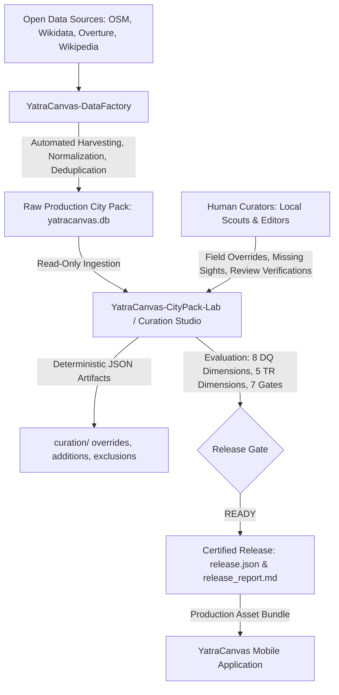
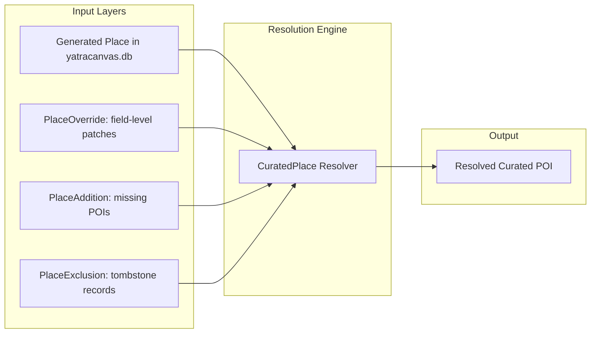
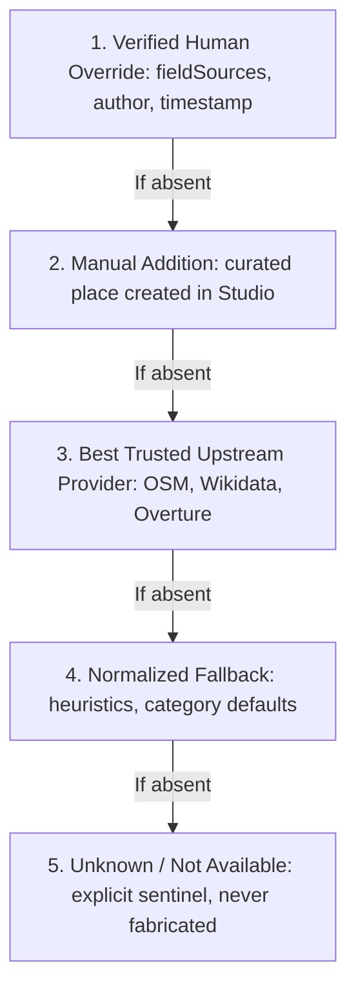
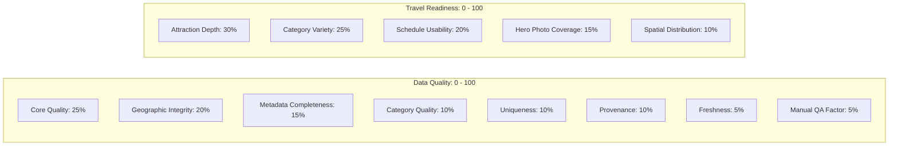
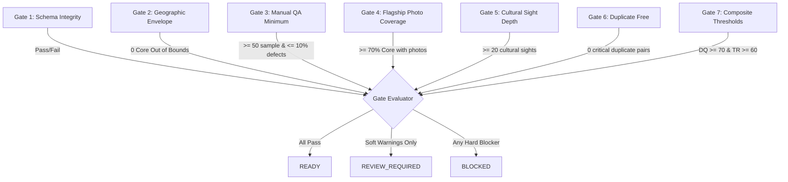
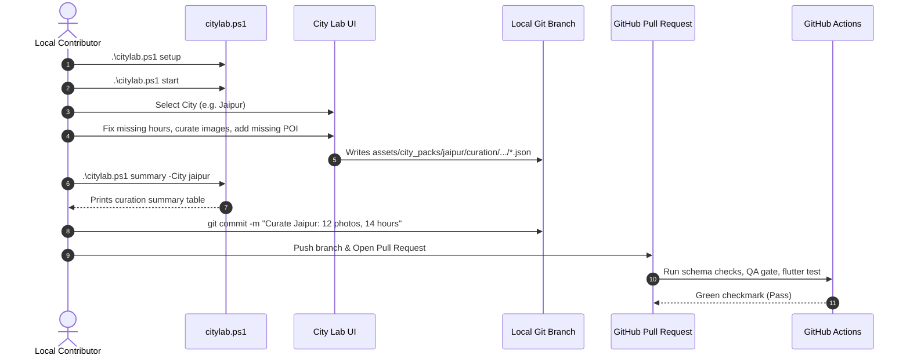

# YatraCanvas City Pack Curation Studio — Architecture & Technical Specification

> **System Responsibility**: Human curation, quality assessment, and release certification gatekeeper for offline City Pack datasets bundled into YatraCanvas.

---

## 1. Ecosystem Overview & Responsibility Boundaries

The YatraCanvas travel platform relies on verified, rich, offline SQLite City Packs. The data flows sequentially through three strictly decoupled systems:



### Responsibility Boundaries

| System | Role | Invariants |
|---|---|---|
| **YatraCanvas-DataFactory** | Automated extraction, entity matching, polygon filtering, SQLite assembly. | Generates baseline SQLite database. Does not evaluate editorial travel readiness. |
| **YatraCanvas-CityPack-Lab** | Inspection, human verification, field corrections, missing sight additions, gatekeeping. | **Read-Only SQLite Input**: Never mutates `yatracanvas.db`. All human edits live in Git-tracked entity-level JSON. |
| **YatraCanvas Mobile App** | Consumer itinerary generation, map exploration, offline travel assistant. | Strictly consumes certified `READY` City Packs. Never curates raw data. |

---

## 2. Persistent Curation Layer Architecture

### The Non-Destructive Invariant

Manual corrections **must never be written destructively** into generated SQLite databases or raw GeoJSON/JSONL outputs. When DataFactory is re-run with newer upstream dumps, human curation work must survive intact.

### Composite Place Resolution Equation



$$\text{CuratedPlace} = (\text{Generated Place} \cup \text{Manual Additions} \setminus \text{Manual Exclusions}) \oplus \text{Human Field Overrides}$$

### Field-Level Precedence Hierarchy

When rendering place details or calculating city statistics, fields are resolved deterministically according to the following precedence order:



---

## 3. Curation Storage & Directory Layout

To eliminate Git merge conflicts among multiple concurrent contributors, all curation artifacts are stored as **individual, deterministic, entity-level JSON files**:

```
assets/city_packs/
  jaipur/
    yatracanvas.db              # Strictly immutable read-only SQLite database
    manifest.json               # Shipped pack manifest and checksums
    city.json                   # Administrative boundary coordinates
    images/                     # Bundled hero and thumbnail webp images
    curation/                   # GIT-TRACKED HUMAN CURATION LAYER
      overrides/                # Field-level corrections (1 JSON per place)
        osm_12345.json
        wikidata_Q724.json
      additions/                # Missing POIs added by scouts (1 JSON per POI)
        manual_panna_meena.json
      exclusions/               # Inappropriate / closed places (1 JSON per place)
        poi_corp_canteen.json
      reviews/                  # Manual QA sample judgements (1 JSON per review)
        rev_osm_12345.json
      issues/                   # Collaborative defect tickets (1 JSON per issue)
        issue_hawa_mahal_photo.json
```

### Deterministic Serialization
Every JSON artifact generated by `CurationRepository` satisfies:
1. **Sorted Keys**: Consistent JSON key order across platforms.
2. **Standard Indentation**: 2-space indentation with trailing newline.
3. **Isolated Identity**: Modifying place A never creates a git diff in place B's record.

---

## 4. Dual Independent Scoring Engines

A dataset can be structurally clean but travel-useless (e.g. 5,000 corporate buildings and zero attractions). City Lab maintains two decoupled evaluation engines:



### 1. Data Quality Score Dimensions (Hygiene & Integrity)
- **Core Quality ($25\%$)**: Completeness of flagship tourist sights (`core_destination`).
- **Geographic Integrity ($20\%$)**: Percentage of coordinates within official city bounding box.
- **Metadata Completeness ($15\%$)**: Presence of names, descriptions, and contact info.
- **Category Quality ($10\%$)**: Valid classification matching YatraCanvas 14-category taxonomy.
- **Uniqueness ($10\%$)**: Freedom from duplicate names or identical coordinates.
- **Provenance ($10\%$)**: Multi-source corroboration (OSM + Wikidata > single source).
- **Freshness ($5\%$)**: Verification timestamps.
- **Manual QA ($5\%$)**: Audit pass rate from human sample.

### 2. Travel Readiness Score Dimensions (Itinerary Viability)
- **Attraction Depth ($30\%$)**: Minimum 20 cultural/tourist sights for multi-day itineraries.
- **Category Variety ($25\%$)**: Healthy distribution across heritage, food, nature, and shopping.
- **Schedule Usability ($20\%$)**: Operating hours availability for itinerary time-blocking.
- **Hero Photo Coverage ($15\%$)**: Primary visual imagery for mobile cards and maps.
- **Spatial Distribution ($10\%$)**: Spread across city districts rather than a single cluster.

---

## 5. Release Gate System & Critical Blocker Overrides

### Non-Negotiable Gate Rule
> **A high composite score CANNOT override a critical failure.**  
> If an attraction is plotted outside city boundaries, or if the 50-place manual QA sample is incomplete, release status is strictly **`BLOCKED`**, regardless of whether the overall score is $95/100$.

### The 7 Release Gates



### Certified Release Artifacts
When a City Pack reaches `READY`, the Release Gate produces:
1. `release.json`: Machine-readable certification record.
2. `quality_report.json`: Detailed dimension-by-dimension breakdown.
3. `release_report.md`: Executive release documentation for pull request audit.

---

## 6. Contributor Collaboration & Git Workflow



---

## 7. Performance & Latency Budgets

City Lab is engineered to run smoothly on production packs exceeding 10,000 places:

| Operation | Target Budget | Real Jaipur Pack Result (10,060 places) |
|---|---|---|
| Text Search (`cafe`, `temple`) | $< 50\text{ ms}$ | **$24\text{ ms}$** |
| Pagination (Offset 500, Limit 50) | $< 50\text{ ms}$ | **$13\text{ ms}$** |
| Spatial Bounding Box Filter | $< 50\text{ ms}$ | **$10\text{ ms}$** |
| Single POI Detail Fetch | $< 20\text{ ms}$ | **$7\text{ ms}$** |
| Dynamic Quality Recalculation | $< 100\text{ ms}$ | **$18\text{ ms}$** |
| Full 36-Test Suite Run | $< 15\text{ s}$ | **$3.8\text{ s}$** |
