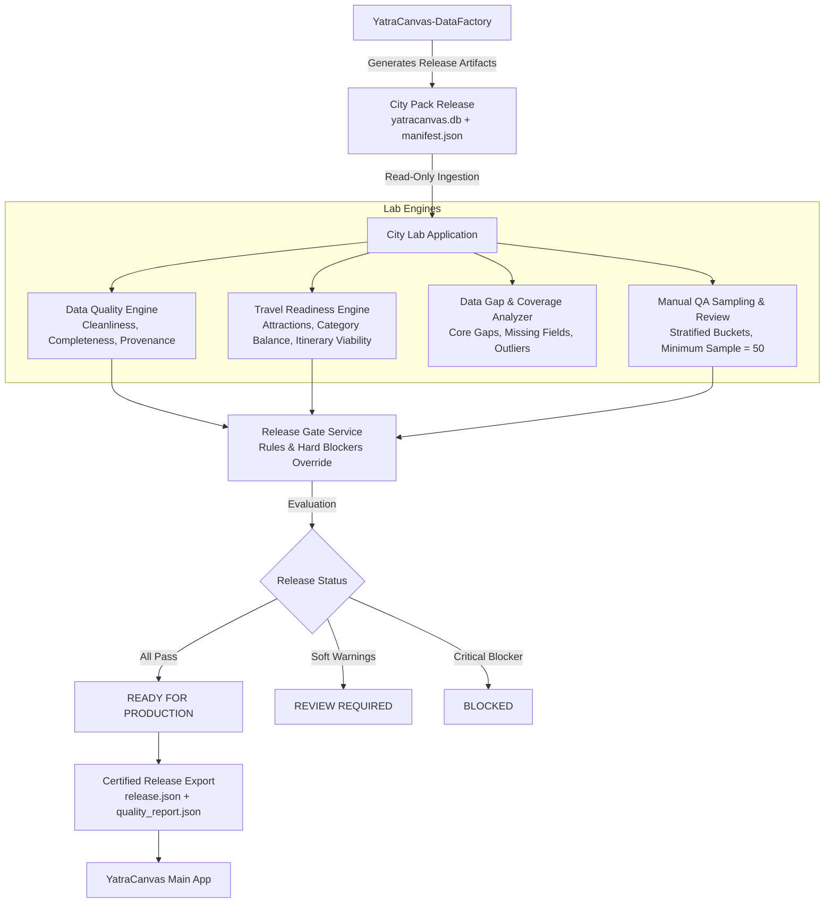
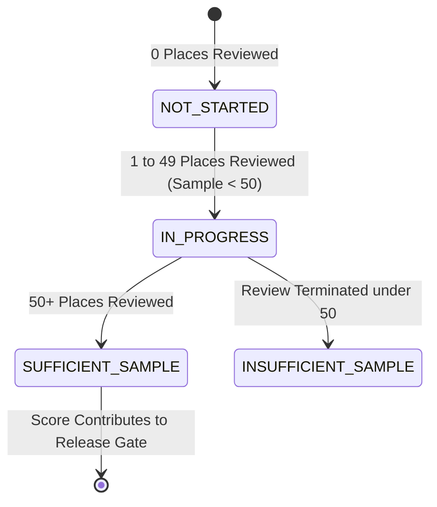

# City Lab Quality & Release Gate Architecture
**Document**: `docs/CITY_LAB_QUALITY_ARCHITECTURE.md`  
**Date**: September 27, 2026  
**Context**: YatraCanvas City Pack Lab (Data Quality, Travel Readiness & Release Certification)

---

## 1. System Architecture & Flow

---

## 2. Scoring Dimensions & Weight Configuration

### A. Data Quality Score (0 – 100)
Answers: *How clean, complete, consistent, and trustworthy is the stored dataset?*

| Dimension | Default Weight | Data Source | Rule Description |
|---|:---:|---|---|
| **Core Destination Quality** | **25%** | `places (tier = 'core_destination')` | Completeness of identity, images, hours, and Wikidata for top landmarks. |
| **Geographic & Identity Integrity** | **20%** | `places (lat, lon)` & `cities (bounds)` | Valid coordinates, inside city service bounds, no coordinate anomalies. |
| **Metadata Completeness** | **15%** | `places (images, hours, website, phone)` | Global presence of key attributes. |
| **Category & Entity Quality** | **10%** | `places (category, subcategory, primary_entity_type)` | Valid travel mapping, low category conflict score. |
| **Uniqueness & Consistency** | **10%** | Spatial overlap groups & deduplication | Freedom from unresolved duplicate clusters. |
| **Source Provenance Quality** | **10%** | `place_sources` & `manifest` | Multi-source confirmation ratio (OSM + Wikidata + Overture). |
| **Freshness** | **5%** | `places.generated_at`, `place_sources.retrieved_at` | Age of data relative to pipeline generation date. |
| **Manual QA Health** | **5%** | `qa_sessions` | Manual review validation rate (only active when sample >= 50). |

*Note: All weights are centralized in `lib/quality/config/quality_weights.dart` and sum to 1.0.*

---

### B. Travel Readiness Score (0 – 100)
Answers: *Is this dataset useful enough for YatraCanvas to create meaningful traveler itineraries?*

A dataset can be 100% clean data-wise (e.g., 5,000 perfectly mapped hotels and gas stations) but completely unviable for travel itinerary generation. Travel Readiness evaluates:
1. **Core Attraction Depth (30%)**: Are there enough high-priority sights (heritage, nature, culture) to anchor 1 to 7 day trips?
2. **Category Balance (25%)**: Adequate balance between sights, dining, cafes, and accommodation without extreme skew.
3. **Hero Media Availability (20%)**: Percentage of Core and Recommended places that have local photo files for travel cards.
4. **Operating Schedule Coverage (15%)**: Opening hours coverage on attractions and food places to avoid sending travelers to closed venues.
5. **Dwell Time & Persona Usability (10%)**: Presence of `recommended_visit_minutes` and `family_friendly` flags.

---

## 3. Manual QA Semantics & State Machine

Manual QA never defaults to 100% when zero reviews exist. It follows a strict 4-state lifecycle:

- **`NOT_STARTED`**: 0 reviews performed. Displays `"NOT STARTED"`. Manual QA weight is neutralized in aggregate score.
- **`IN_PROGRESS`**: Reviews logged, but sample size < `minimumManualQaSample` (default: 50). Displays `"PENDING (X/50)"`.
- **`SUFFICIENT_SAMPLE`**: Minimum sample reached. Defect flag rate and approval rate now actively contribute to the Release Gate.

---

## 4. Release Gate Logic & Critical Failure Overrides

A high weighted quality score **never overrides a critical failure**.

### Hard Release Blockers (Trigger `BLOCKED` status immediately):
1. **Corrupt Schema / Invalid Pack**: DB cannot be read, manifest missing or corrupt.
2. **Core Landmark Coordinate Failure**: Any Core Destination located outside city bounds or with invalid lat/lon.
3. **Severe Core Image Shortage**: Core landmark image coverage below configured minimum (e.g. < 60%).
4. **Insufficient Attraction Base**: Fewer than minimum required tourist attractions for the city type.
5. **Unresolved Critical QA Flag**: Manual QA reveals confirmed severe data flaws in Core POIs.
6. **Manual QA Sample Incomplete**: Mandatory verification sample not yet met.

### Release Statuses:
- **`READY`**: All release gates passed, no critical blockers, Data Quality >= threshold, Travel Readiness >= threshold.
- **`REVIEW_REQUIRED`**: No hard blockers, but notable warnings exist (e.g. low opening hours coverage, category skew).
- **`BLOCKED`**: One or more critical blockers triggered.

---

## 5. Unknown vs Zero vs Not Measured Semantics

| State | Meaning | Display Text | Numeric Value |
|---|---|---|---|
| **Measured Value** | Measured and calculated | `82%`, `14%` | Value between 0.0 and 1.0 |
| **Actual Zero** | Measured and confirmed zero (e.g. 0 images) | `0%` | 0.0 |
| **Not Measured** | Metric is measurable but unreviewed yet | `NOT MEASURED` / `PENDING` | `null` (excluded from weighting) |
| **Unknown / Unavailable** | Underlying data does not exist in schema | `UNKNOWN` / `N/A` | `null` (displays neutral chip) |
| **Failed** | Hard violation of a validation gate | `FAILED` / `BLOCKED` | Explicit blocker recorded |

---

## 6. Stratified QA Sampling Model

To make manual review realistic across 10,000+ records, `QaSamplingService` provides stratified, deduplicated sample sets:
- **Core POIs (20 places)**: Top landmarks that travelers see first.
- **Random Background (20 places)**: Random cross-section across all tiers.
- **Low Confidence / High Anomaly (15 places)**: Highest `anomaly_score` or lowest `quality_overall`.
- **Category Balanced (20 places)**: 2 places each across under-represented categories.
- **Geographic Outliers (15 places)**: Places nearest or outside the bounding box perimeter.

---

## 7. Certified Release Artifacts

Upon meeting the `READY` status, City Lab exports:
- `release.json`: Lightweight machine-readable certification token consumed by YatraCanvas.
- `quality_report.json`: Full metric breakdown and dimension scoring.
- `release_report.md`: Human-readable summary for data engineers and product managers.
